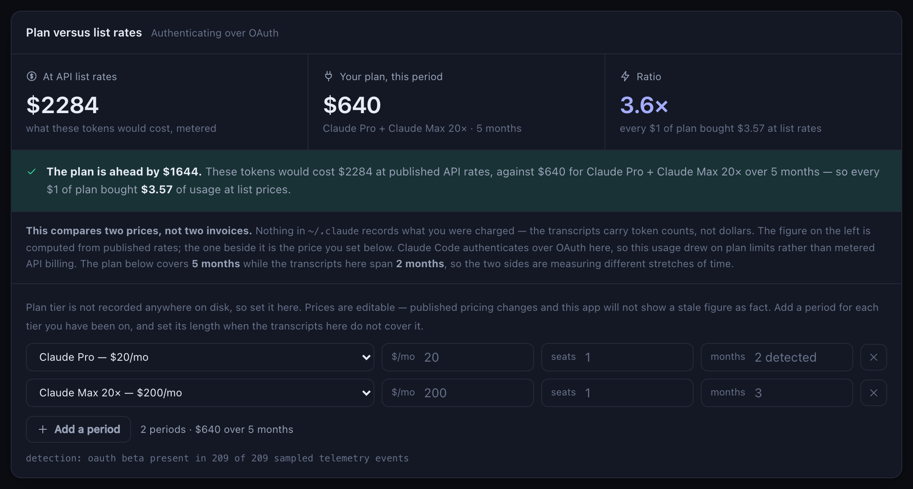
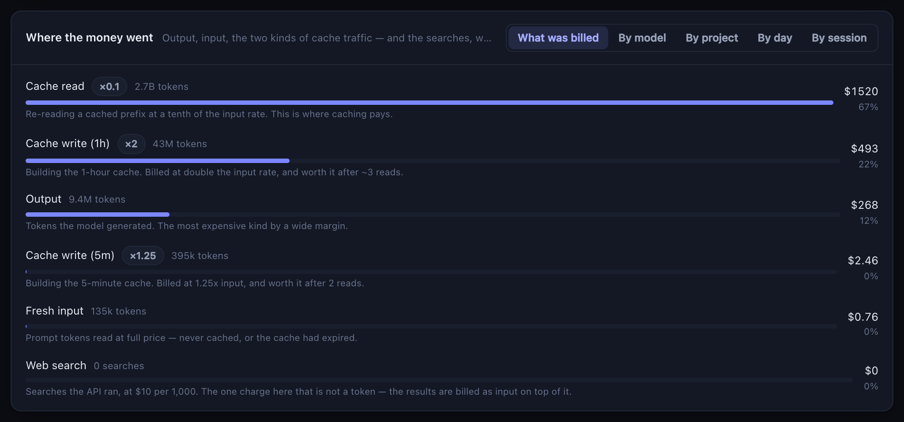
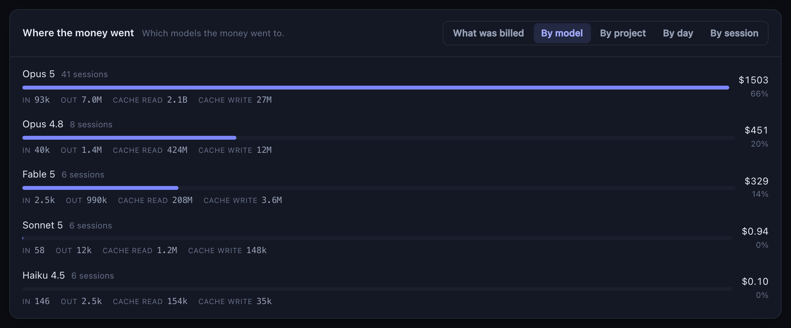
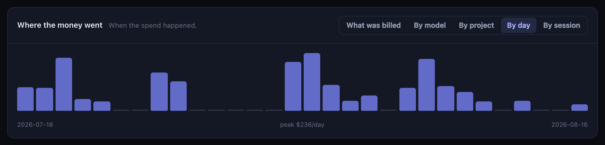
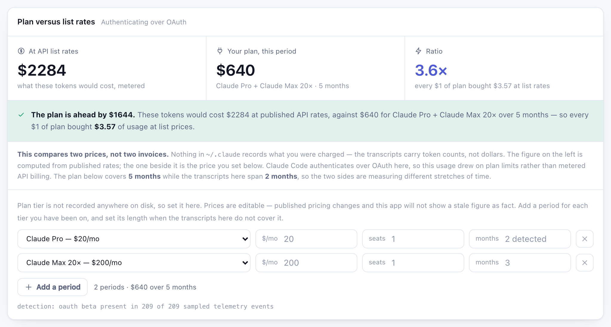
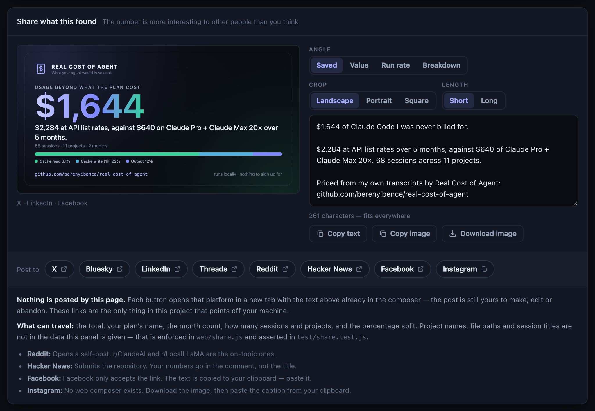

<div align="center">


# Real Cost of Agent

**What your agent would have cost.**

Claude Code already writes down every token it spent. This adds them up, prices them at published
API rates, and tells you what your subscription actually bought.

[](https://github.com/berenyibence/real-cost-of-agent/actions/workflows/ci.yml)
[](LICENSE)
[](https://nodejs.org)
[](package.json)

</div>

---

> **68 sessions. 10,444 API calls. 2.7B cached tokens. $2,284 at API list rates — against $640 of plan.**
>
> That is one laptop, read in under a second. Every figure came off its own disk, and nothing was
> sent anywhere to produce it.



```bash
git clone https://github.com/berenyibence/real-cost-of-agent.git
cd real-cost-of-agent
node server/index.js
```

Then open **http://127.0.0.1:4319**. That is the whole setup — there is no `npm install`, because
there is nothing to install. No account, no API key, no build step, no dependencies.

---

## The number nobody shows you

Claude Code writes a transcript of every session to `~/.claude`, and every assistant reply in it
carries the exact token counts the API measured — input, output, cache reads, cache writes, per
model, per request. The billing was done from those numbers. Almost nobody adds them up.

This does, and then compares it against what you pay.

> [!NOTE]
> **Adding them up is harder than it looks, and getting it wrong flatters you.** Claude Code writes
> one assistant turn as several transcript lines — one for the `thinking` block, then one per
> `tool_use` — and **every one of those lines repeats the same `usage` object.** Summing line by line
> bills each request once per block it happened to contain. On the same machine as the figures above,
> back when this was caught, that was 21,131 lines for 10,422 real calls: **$6,091 where the truth was
> $2,490, overstated by 2.45×.**
> The error scales with tool use, so the biggest sessions are the most wrong. See
> [`test/dedupe.test.js`](test/dedupe.test.js).

> [!NOTE]
> **A session is also more than one file.** Every subagent gets its own transcript, one directory
> below the session that spawned it — `projects/<cwd>/<sessionId>/subagents/agent-<id>.jsonl` — and
> those lines carry their own request ids and their own usage, because they were their own API
> calls. Read only the top level and that work is billed to nobody, **with nothing on the page to
> suggest it**: every cut still adds up perfectly to a total the money never reached. The error
> scales with how much you delegate. Subagent transcripts are folded into the session that spawned
> them, and each one is priced at the model it actually ran on — a Haiku search inside an Opus
> session is billed as Haiku. See [`test/subagents.test.js`](test/subagents.test.js).

**Two prices, not two invoices.** Nothing in `~/.claude` records what you were charged. The
transcripts carry token counts and a `service_tier`; no field anywhere names a dollar, a credit or an
invoice. So both figures are computed, and the page says so next to them rather than in a footnote:

- **The left-hand number** is your recorded tokens at published list rates.
- **The middle number** is what _you_ say you pay. Your tier is not on disk anywhere and published
  prices change, so it is editable rather than asserted.
- **Auth mode is detected**, from the beta set Claude Code records in local telemetry. That tells you
  which of the two figures is the hypothetical one. It does not tell you what you were billed, and
  the page no longer pretends otherwise.

**Your plan is a history, not a tier.** Most people have not been on one plan for the whole period.
Add a row per tier — two months of Pro then three of Max is $640, and no single tier price says so:

| Field      | Meaning                                                                              |
| ---------- | ------------------------------------------------------------------------------------ |
| **Tier**   | The plan for that stretch. Add or remove rows; one row is always kept.                |
| **$/mo**   | Override the list price — a grandfathered rate, a discount, a currency that is not USD |
| **seats**  | For per-seat plans                                                                     |
| **months** | How long you were on it. **Leave it empty and the transcripts decide.**                 |

The months box is the one that matters most once your history is incomplete. The app can only see the
transcripts on _this_ machine, so a reinstall, a second laptop, or a `~/.claude` you have cleaned out
all make the detected span shorter than what you actually paid for. Type the real number and the
comparison is right again. When the two disagree, the page says so rather than quietly dividing one
by the other.

**The verdict can go against the plan.** When your usage does not justify what you pay, the panel
says so and points at metered API billing — same voice, same size, same prominence as when it goes
the other way. A tool that can only ever conclude "your subscription is excellent" is an
advertisement.

**Where the money went.** The headline number is the top of a tree. Each cut re-splits the same
dollars a different way, so a figure can be opened until it stops being a mystery:



| Cut            | Answers                                                                          |
| -------------- | -------------------------------------------------------------------------------- |
| What was billed | Output, fresh input, cache reads, 5m / 1h cache writes — and web searches, which are billed per search rather than per token |
| By model       | Which models the money went to — and, from the token split on each row, why that one |
| By project     | Which codebases cost the most                                                    |
| By day         | When the spend happened                                                          |
| By session     | Every run, with the token counts behind each figure                              |

**The session list is all of it.** It used to be a top twelve, which made it the one cut that did not
add up to the total — on the index this was built against, twelve rows was 45% of the money and the
other 55 sessions had no row anywhere in the app. It is now every priced session, it sums like every
other cut, and it carries what the dollar figure was computed from:

| Per row                                        | Why it is there                                                  |
| ---------------------------------------------- | ---------------------------------------------------------------- |
| **Fresh input, output, cache read, cache write** | Four counts, not one, because they are billed at four different multipliers — which is the whole reason two sessions of the same size cost different amounts |
| **Requests**                                    | API calls, not transcript lines. The denominator for what one request cost |
| **Cache hit rate, context peak**                | Whether a long run was being run efficiently                     |
| **When it ran**                                 | A duration inside one day; a date range when it spans several, because first-to-last timestamp on a resumed session is not time spent |

Filter by session or project, sort by cost, recency, output, tokens or requests. The footer says what
is on screen and what it is out of, in both rows and dollars.

**Every row carries its token split, so a bill can be argued with.** A model row that shows one dollar
figure invites exactly one question and cannot answer it. These can: 2.1B cache reads is a very
different story from 7M output tokens, and they are the reason one model took two thirds of the bill.



<details>
<summary><b>By day, and the light theme</b></summary>

<br />





</details>

**What the total leaves out, and what it had to assume.** Three caveats travel with the figure
rather than being buried: sessions priced at their tier's rate because the exact model id is not in
the catalog, sessions where some requests named a model with no published rate at all — a gateway or
proxy route — and were billed at the rate the rest of that session ran at, and sessions excluded
entirely because nothing in them could be priced, with the token count they represent so you can
tell a footnote from a hole. The three are counted separately because they are not equally
confident: a tier read out of an id is a better guess than a rate borrowed from elsewhere in the
same session, and neither is a published price.

## Share it

Most people have no idea what their agent use is worth. The page will build the post for you — a
card image and the words to go with it — for X, Bluesky, LinkedIn, Threads, Reddit, Hacker News,
Facebook and Instagram.



**Four angles, because the same numbers persuade different people for different reasons.** Picking
one rewrites the words and the headline on the card together, so they can never contradict each
other:

| Angle         | The question it answers                                          | Best for                            |
| ------------- | ---------------------------------------------------------------- | ----------------------------------- |
| **Saved**     | How many dollars of work was I never billed for?                 | The default — the number people repeat |
| **Value**     | What did every $1 of plan actually buy?                          | A large multiple — often Pro at $20 |
| **Run rate**  | What would this habit cost per month if I paid per token?        | Deciding whether Max at $200 is worth it, or whether metered is even affordable |
| **Breakdown** | Where did it actually go — output, or cache?                     | A technical audience                |

Every angle names the gap, and **every angle survives it running the other way.** If your plan cost
more than your usage was worth, the card says that instead — the "Saved" angle inverts to what the
plan cost above metered rates. There is no combination of settings that produces a saving you did not
make.

Two more things are true of the panel, and both are deliberate:

- **Nothing is posted by this page.** Each button opens that platform's own composer in a new tab
  with the text already in it. The post is still yours to edit, or to abandon. Those links are the
  only thing in this project that points off your machine.
- **Only aggregates can travel.** The share panel is handed a fixed set of numbers — the total, your
  plan's name and price, the month count, how many sessions and projects, and the percentage split.
  Project names, file paths and session titles are not in the data it receives, so no amount of
  editing can put them in a post. That boundary is one function in [`web/share.js`](web/share.js),
  and [`test/share.test.js`](test/share.test.js) asserts it against a payload seeded with paths in
  every field that has one, across every angle.

The image is painted on a canvas in your browser and saved with **Download image**, at 1200×630 for
X, LinkedIn and Facebook, or 1080×1350 and 1080×1080 for Instagram and Threads.

## Requirements

- **Node 20.11 or newer.** Nothing else.
- **Claude Code, run at least once**, so there are transcripts to read. If there are none, the page
  says so and names the directory it looked in.

## What it touches

| Path                                        | Access     | Why                                             |
| ------------------------------------------- | ---------- | ----------------------------------------------- |
| `~/.claude/projects/**/*.jsonl`             | read       | token usage per request, per model              |
| `~/.claude/telemetry/*.json`                | read       | whether you authenticate by OAuth or an API key |
| `~/.config/real-cost-of-agent/config.json`  | read/write | your plan, its price, and seat count            |

**Nothing leaves your machine.** The server binds to loopback and makes no outbound request of any
kind — the only HTTP traffic is your browser talking to `127.0.0.1`. If the page is showing a number,
it came off your own disk. The share links are the single exception, and they are exactly that:
links, which do nothing until you click one.

**And nothing else on your machine can read it either.** A local server with no password is still
reachable by whatever page you happen to have open in another tab, and this one serves your project
names, working directories and session titles. So it answers only to a `Host` of `localhost` or a
bare IP address — which is what makes DNS rebinding impossible rather than merely unlikely — and
refuses any request carrying an `Origin` that is not its own, which is what stops a site you are
visiting from rewriting your stored plan through `POST /api/billing`. Both rules are in
[`server/access.js`](server/access.js) and asserted from both sides in
[`test/access.test.js`](test/access.test.js).

**"No network calls" is a header, not just a promise.** The page is served under
`default-src 'self'; connect-src 'self'; frame-ancestors 'none'`, so a CDN script, a remote font, an
analytics beacon or a `fetch` to anywhere but this server is refused by your browser rather than
merely absent from the source. It is the one claim in this README you do not have to take on trust —
open the network tab and there is nothing in it. CI asserts the header on every push.

## Configuration

Every setting is an environment variable, and every one has a working default:

```bash
PORT=4400 node server/index.js          # default 4319
HOST=127.0.0.1 node server/index.js     # loopback; change at your own risk
CLAUDE_HOME=/path/to/.claude npm start  # read someone else's export, or a backup
XDG_CONFIG_HOME=~/.config npm start     # where this app stores your plan
```

Ports 4317 and 4318 are OpenTelemetry's collector defaults and are often already taken on a machine
that runs agents, which is why the default here is 4319.

## How the money is worked out

Every figure comes from the `usage` block the API returned on each assistant reply — measurements
taken by the thing that was billed, not an estimate made afterwards by counting characters.

- **Each API call is counted once, however many lines it was written as.** This is the one that bit.
  Claude Code writes a single assistant turn as several transcript lines — one for the `thinking`
  block, then one per `tool_use` — and every one of them carries a complete copy of the *same* usage
  block. Adding them up line by line charges a request once per block it contained: on the corpus
  this was found against, 21,131 lines for 10,422 real calls, and a total of $6,091 where the truth
  was $2,490. Usage is now keyed by request id and folded in once. See
  [`test/dedupe.test.js`](test/dedupe.test.js).
- **A subagent's calls belong to the session that spawned it.** They are written to a separate
  transcript one directory down, and they are separate API calls at whatever model the subagent ran
  on. They are folded into the parent session — same run, same project, same day — with each
  subagent's requests kept as their own billing slice so the model mix stays honest. A subagent
  whose parent transcript has since been deleted is still counted; a missing parent does not un-bill
  the work.
- **A model id is not the whole rate.** The same request to the same model costs different amounts
  depending on two fields the transcript already records, and both are per request rather than per
  session:
  - **`/fast` is billed at its own published rate.** Fast mode runs Opus 5 and Opus 4.8 at $10/$50
    instead of $5/$25 — **exactly double** — and it can be toggled mid-run. Pricing those off the
    standard column halves them.
  - **US-pinned inference adds 1.1×** on every category.

  So a billing slice is a model *plus* those terms, and one model can appear twice in the same
  session at two different prices. A run that toggled `/fast` halfway through is exactly that.
- **Rates are per model, in `server/models.js`.** They are USD per million tokens as published for
  the first-party Anthropic API. Partner platforms (Bedrock, Vertex) price separately and are not
  modelled.
- **Cache traffic is billed at its real multipliers**: reads at 0.1×, 5-minute writes at 1.25×,
  1-hour writes at 2×. The transcript records the TTL split per request, so this is computed rather
  than assumed. When a write carries no split it is attributed to 5m — the cheaper TTL, so an
  unknown can never inflate the bill.
- **A session is priced per model, not as one.** Switching mid-run is ordinary and the tiers differ
  by up to 2×, so each slice of a session is priced at its own rate.
- **A model the catalog has not heard of is priced at its tier's list rate and flagged as inferred.**
  A confident $0 for a model that shipped last week is the one error that reads as good news, so it
  is not an option here.
- **A session is priced whenever any part of it can be.** Run through a gateway and some requests
  carry that gateway's own route name, which names no tier to reason from. Those are billed at the
  rate the rest of the session ran at and the row is marked **borrowed rate** — the alternative,
  which this used to do, was to drop the whole session and every exactly-priceable Claude token in
  it. If nothing in a session can be priced it is still excluded, and still counted.

Prices change. Edit the `CATALOG` in `server/models.js` when they do — it is a plain object, and the
tests will tell you if you break the arithmetic. That is [the most useful pull request you can
send](CONTRIBUTING.md#the-most-useful-contribution).

## Tests

```bash
npm test
```

Node's built-in runner, no framework. The suite covers the pricing rules, the plan arithmetic, the
config sanitiser, the share boundary, and an end-to-end pass over a fixture transcript. The property
that matters most is asserted directly: **every breakdown adds up to the same total.** A column that
quietly uses different arithmetic from the number above it is the worst way for a money view to be
wrong, because nothing on screen suggests you should check.

## Layout

```
server/
  index.js    HTTP: three read routes, one write route, static files
  access.js   which hosts and origins this server will answer at all
  scan.js     reads ~/.claude transcripts, subagents included → sessions with token counts
  store.js    the in-memory index, and pricing applied to it
  models.js   the model catalog: rates, context windows, cache multipliers
  spend.js    the breakdown — the same dollars, split five ways, each summing to the total
  billing.js  subscription vs API: plans, auth detection, the comparison
  day.js      local calendar days, so an evening session is filed today
  paths.js    where this app keeps its one preference file
web/
  index.html  the page
  theme.js    light or dark, applied before the first paint
  app.js      the page's behaviour — plain DOM, no framework
  share.js    the share card: the aggregate allowlist, the words, the canvas
  styles.css  design tokens and components, light and dark
  brand/      the mark, the lockup, and the repository's social preview
```

## Contributing

Yes, please — start with [CONTRIBUTING.md](CONTRIBUTING.md). Model prices move constantly and a
one-line catalog update is a genuinely valuable pull request. The house rules that matter most are
short: no dependencies, no build step, no network calls, and every breakdown has to add up.

By taking part you agree to the [Code of Conduct](CODE_OF_CONDUCT.md). To report a security issue,
see [SECURITY.md](SECURITY.md).

## Licence

Apache-2.0. See [LICENSE](LICENSE).

**Not affiliated with Anthropic.** Claude and Claude Code are trademarks of Anthropic. This is an
independent tool that reads files Claude Code writes locally, and the prices in it are a
hand-maintained copy of published rates — always check your real invoice before treating any figure
here as authoritative.
